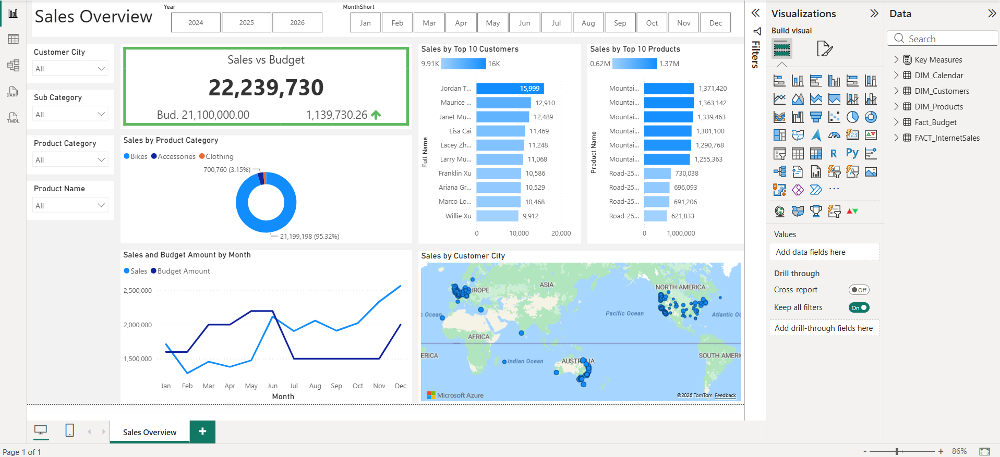
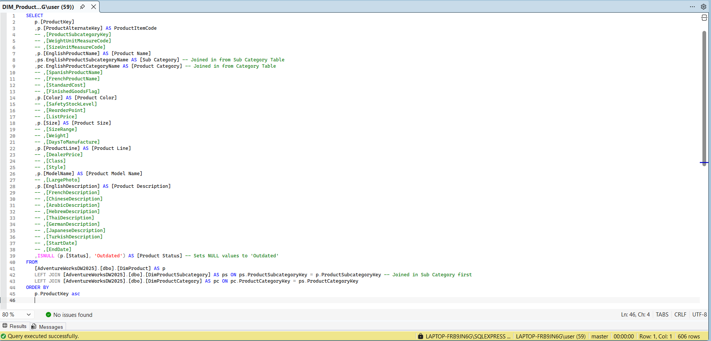

# Sales Overview Dashboard — Power BI & SQL

An end-to-end data analyst project: a business request was translated into user stories, a SQL Server data warehouse (AdventureWorksDW2025) was queried and cleaned, and a Power BI dashboard was built to give Sales the visual reporting it asked for.



## Project Background

The Sales Manager (Steven) reached out, asking to move away from static sales reports and into visual dashboards. The full request is documented in [`docs/Business-Request-(Mail-from-Steven).docx`](docs/Business-Request-(Mail-from-Steven).docx), but in short, the team wanted to see:

- How much has been sold, of what products, to which clients, over time
- The ability to filter by salesperson, customer, and product
- Performance measured against a 2026 budget, looking back two years for context

## From Request to User Stories

The request was broken down into four user stories covering both the Sales Manager's and Sales Representatives' needs (overview KPIs vs. budget, and drill-down views by customer and by product). The full set of user stories with acceptance criteria is in [`docs/Business-Demand-Overview-&-User-Stories.docx`](docs/Business-Demand-Overview-&-User-Stories.docx).

## Data Source

Data was sourced from the **AdventureWorksDW2025** SQL Server sample data warehouse, plus a supplied 2026 budget spreadsheet (`SalesBudget.xlsx`).

Each table was queried directly in SQL Server Management Studio to select, rename, and join only the fields needed for reporting, rather than importing raw tables wholesale into Power BI:

- **`DIM_Customers`** — first/last name combined into a `Full Name` column, gender codes mapped from `M`/`F` to `Male`/`Female`, and `Customer City` joined in from `DimGeography`. Demographic, address, and marketing fields not needed for this report were excluded.
- **`DIM_Products`** — product subcategory and category joined in and flattened into single descriptive `Sub Category` / `Product Category` columns; localized description fields and pricing/manufacturing fields excluded; `NULL` statuses defaulted to `'Outdated'`.
- **`DIM_Calendar`** — standard date attributes plus a derived `MonthShort` column, filtered to `CalendarYear >= 2024` so the model only carries the two years of history the business asked for.
- **`FACT_InternetSales`** — order/customer/product keys and `SalesAmount`, filtered to the trailing two years (`OrderDateKey` >= two years before today) to match the business's reporting window. Pricing, discount, tax, and shipping detail columns not used in the dashboard were excluded.

**Sample query — `DIM_Products`:**



All queries used to build the model are in [`sql/`](sql/), and the cleaned CSV/XLSX extracts loaded into Power BI are in [`data/`](data/).

## Data Model

The Power BI model follows a star schema:

- **Fact_InternetSales** (from SQL) and **Fact_Budget** (from `SalesBudget.xlsx`, monthly 2025 budget figures) as fact tables
- **DIM_Customers**, **DIM_Products**, **DIM_Calendar** as dimension tables, each joined on their respective keys

This keeps the model lean and filter performance fast, and lets the report filters (Customer City, Sub Category, Product Category, Product Name) consistently drive every visual.

## Dashboard

The final report is a single-page **Sales Overview** in Power BI:

| Feature | Description |
|---|---|
| Sales vs Budget KPI | Total sales against 2026 budget, with the variance called out |
| Sales by Product Category | Donut chart split across Bikes, Accessories, Clothing |
| Sales by Top 10 Customers | Ranked bar chart of highest-value customers |
| Sales by Top 10 Products | Ranked bar chart of best-selling products |
| Sales and Budget by Month | Trend line comparing actual sales to budget over the year |
| Sales by Customer City | Geographic map of where sales are coming from |
| Filters | Year, Month, Customer City, Sub Category, Product Category, Product Name |

This directly answers the user stories: Sales Managers get the budget-vs-actual overview and trend. At the same time, Sales Representatives can filter down to a single customer or product to follow their own book of business.

## Tools Used

- **SQL Server Management Studio** — querying and shaping the AdventureWorksDW2025 source data
- **Power BI Desktop** — data modelling (star schema) and dashboard design
- **Power Query / DAX** — transformations and measures (e.g. Sales vs Budget variance)

## Repository Contents

```
sales-overview-dashboard/
├── README.md
├── sales-overview.pbix          # Power BI report file
├── sql/                         # SQL queries used to build each dimension/fact table
│   ├── DIM_Customers.sql
│   ├── DIM_Products.sql
│   ├── DIM_Calendar.sql
│   └── FACT_InternetSales.sql
├── data/                        # Cleaned extracts loaded into the Power BI model
│   ├── DIM_Customers.csv
│   ├── DIM_Products.csv
│   ├── DIM_Calendar.csv
│   ├── FACT_InternetSales.csv
│   └── SalesBudget.xlsx
└── docs/
    ├── business-request.md      # Original business request
    ├── user-stories.md          # User stories & acceptance criteria
    └── screenshots/             # Dashboard and process screenshots
```

## Notes

This was built as a portfolio project to demonstrate the full analyst workflow: gathering requirements, writing user stories, querying and cleaning a relational source, modeling data, and designing a dashboard that answers the original business need — not just a finished `.pbix` file.
